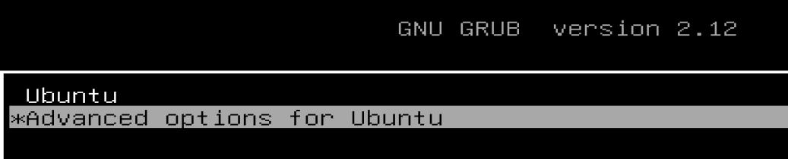
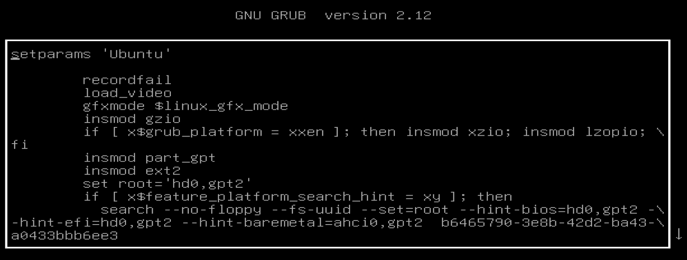
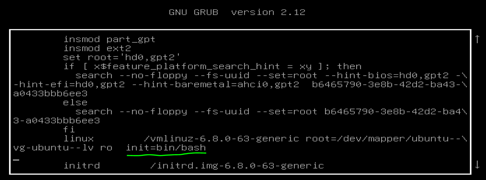
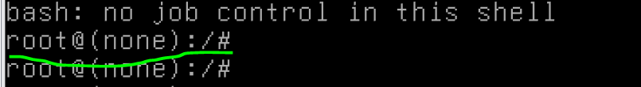
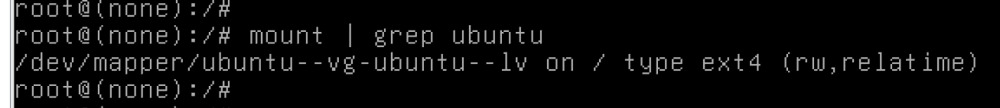
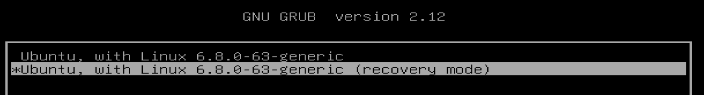
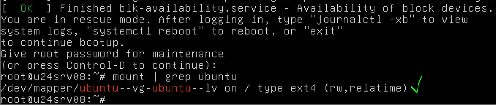

## Работа с загрузчиком
#### Задание
+ Включить отображение меню Grub.  
+ Попасть в систему без пароля несколькими способами.
+ Установить систему с LVM, после чего переименовать VG.

#### Включить отображение меню Grub
По умолчанию меню загрузчика Grub скрыто и нет задержки при загрузке. Для отображения меню нужно отредактировать конфигурационный файл. Строку с параметром GRUB_TIMEOUT_STYLE=hidden просто закомментируем и установим GRUB_TIMEOUT=10  
```
cp /etc/default/grub /etc/default/grub.bak
root@u24srv08:~# cd /etc/default/
root@u24srv08:~# nano grub
root@u24srv08:/etc/default# cat /etc/default/grub 
# GRUB_TIMEOUT_STYLE=hidden
GRUB_TIMEOUT=10
root@u24srv08:/etc/default#
```
Обновляем конфигурацию загрузчика и перезагружаемся для проверки.
```
root@u24srv08:/etc/default# update-grub
Sourcing file `/etc/default/grub'
Generating grub configuration file ...
Found linux image: /boot/vmlinuz-6.8.0-63-generic
Found initrd image: /boot/initrd.img-6.8.0-63-generic
Warning: os-prober will not be executed to detect other bootable partitions.
Systems on them will not be added to the GRUB boot configuration.
Check GRUB_DISABLE_OS_PROBER documentation entry.
Adding boot menu entry for UEFI Firmware Settings ...
done
root@u24srv08:/etc/default#
```
После перезагрузки отображается меню загрузчика  


#### Попасть в систему без пароля несколькими способами

+ Способ 1. init=/bin/bash 
В конце строки, начинающейся с linux, добавляем init=/bin/bash и нажимаем сtrl-x для загрузки системы. Рутовая файловая система при этом монтируется в режиме Read-Only.


Для перевода в режим Read-Write можно воспользоваться командой mount -o remount,rw /


Проверить можно командой mount 


+ Способ 2. Recovery mode
В меню загрузчика на первом уровне выбрать второй пункт (Advanced options…), далее загрузить пункт меню с указанием recovery mode в названии. 



### Установить систему с LVM, после чего переименовать VG
+ текущее состояние системы (список Volume Group)
```
root@u24srv08:~# vgs
  VG        #PV #LV #SN Attr   VSize  VFree
  ubuntu-vg   1   1   0 wz--n- 18.22g 8.22g
root@u24srv08:~#
```
Переименование VG: vgrename ubuntu-vg ubuntu-otus
```
root@u24srv08:~#
root@u24srv08:~# vgrename ubuntu-vg ubuntu-otus
  Volume group "ubuntu-vg" successfully renamed to "ubuntu-otus"
root@u24srv08:~#
```
Далее правим /boot/grub/grub.cfg   
Везде заменяем старое название VG на новое (в файле дефис меняется на два дефиса ubuntu--vg ubuntu--otus).
Проверяем, все ли вхождения названия VG заменены
```
root@u24srv08:~#
root@u24srv08:~# cat !$ | grep ubuntu--vg
cat /boot/grub/grub.cfg | grep ubuntu--vg
root@u24srv08:~#
root@u24srv08:~# cat /boot/grub/grub.cfg | grep ubuntu--otus
        linux   /vmlinuz-6.8.0-63-generic root=/dev/mapper/ubuntu--otus-ubuntu--lv ro
                linux   /vmlinuz-6.8.0-63-generic root=/dev/mapper/ubuntu--otus-ubuntu--lv ro
                linux   /vmlinuz-6.8.0-63-generic root=/dev/mapper/ubuntu--otus-ubuntu--lv ro single nomodeset dis_ucode_ldr
root@u24srv08:~#
```
После чего можем перезагружаться и, если все сделано правильно, успешно грузимся с новым именем Volume Group и проверяем:
```
root@u24srv08:~# vgs
  VG          #PV #LV #SN Attr   VSize  VFree
  ubuntu-otus   1   1   0 wz--n- 18.22g 8.22g
root@u24srv08:~#
```
По этому же сценарию можно заменить наименование Logical Volume
### ДЗ-08 выполнено 
